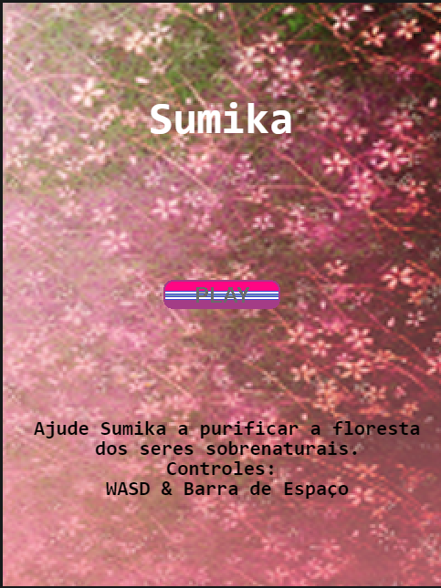

# Trabalho de Sistemas Multimídia
Projeto de desenvolvimento de um jogo shooter simples em arcade com a linguagem JavaScript e uso do framework phaser.

O jogo em si, "Sumika",  se trata de um shooter onde uma jovem sacerdotisa viajante que, em meio à sua jornada, se deparou com uma floresta amaldiçoada, e agora, luta para purificar a floresta.

Os controles são WASD para movimentar, Barra de Espaço para atirar. Créditos à York Computer Solutions LLC pelo tutorial seguido para a realização do jogo.

## Membros do Grupo
Mateus Pequeno - Código

Victor Maciel - Código e Assets

Hugo Pinto - Vídeo e Assets

## Imagens
Todas as imagens e sprites foram tiradas do spriteresources.com

